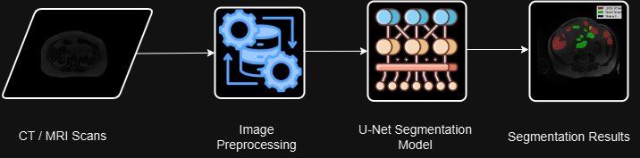

## Gastro Intestinal Organ Segmentation

- Hi guys, this project is about segmenting the CT/MRI scans of gastro-intestinal cancer patient's abdomen.
- This project uses U-Net model to segment the scan images.

### Tech Stack

- Python
- React
- Flask
- U-Net Architecture

### Architecture

### How to run

- Clone the repository
- Install the dependencies in a virtual environment(Python dependencies) and make sure the system has node installed.
- For frontend, navigate to `Frontend` directory and run `npm start` command.
- For backend, navigate to `Scan Segmentation` directory and run `python main.py` command.
